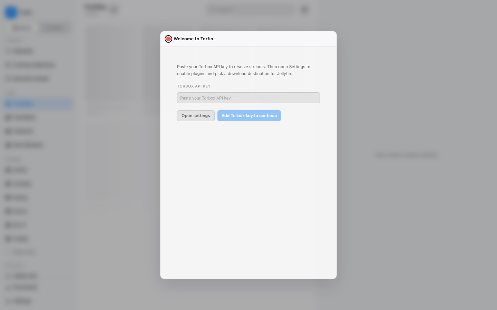

<pre align="center">
████████╗ ██████╗ ██████╗ ███████╗██╗███╗   ██╗
╚══██╔══╝██╔═══██╗██╔══██╗██╔════╝██║████╗  ██║
   ██║   ██║   ██║██████╔╝█████╗  ██║██╔██╗ ██║
   ██║   ██║   ██║██╔══██╗██╔══╝  ██║██║╚██╗██║
   ██║   ╚██████╔╝██║  ██║██║     ██║██║ ╚████║
   ╚═╝    ╚═════╝ ╚═╝  ╚═╝╚═╝     ╚═╝╚═╝  ╚═══╝
</pre>

<h1 align="center">Torfin</h1>

<p align="center">
  <strong>Browse streams. Download to Jellyfin. Done.</strong><br>
  Stremio-compatible addons, Torbox resolution, and one-click library imports.
</p>

<p align="center">
  <a href="https://github.com/al5ina5/torfin/releases/latest">Download</a>
  ·
  <a href="https://github.com/al5ina5/torfin/pkgs/container/torfin">Docker</a>
  ·
  <a href="docs/README.md">Docs</a>
</p>

<br>

<p align="center">
  
</p>

<br>

## Install

### macOS

**Download, open, run.**

1. Grab the latest `.dmg` from [Releases](https://github.com/al5ina5/torfin/releases/latest)
2. Drag **Torfin** to Applications
3. Launch it

That's it. Paste your Torbox key on first launch, then open **Settings** to wire up plugins and Jellyfin.

---

### Docker

**One command. Open the browser.**

```bash
docker run -d --name torfin -p 3020:3020 -v torfin-data:/data -v torfin-movies:/media/movies ghcr.io/al5ina5/torfin:latest
```

Then go to **[http://localhost:3020](http://localhost:3020)**

Mount your real movies folder by swapping `torfin-movies` for a host path, e.g. `-v /srv/media/movies:/media/movies`. Full Jellyfin setup lives in the [docs](docs/setup.md).

---

<p align="center">
  <sub>MIT · built for Torbox + Jellyfin homelabs</sub>
</p>
